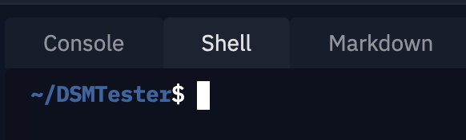
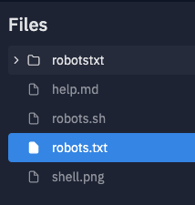

# DSM Testing Repl

This repl provides some tools to help debugging indexing issues: curl and a robots.txt tester. All tools here will use the shell, so you should always input the commands belou in the shell tab:



## Using the robots.txt tester

1. Copy the website's robots.txt file into the robots.txt file in this repl



2. Go the the Shell tab


3. Type:

`./robots.sh [the URL you're testing here]`

If the page is allowed by robots.txt you will see:

`> user-agent 'Googlebot' with URI 'https://example.com/': ALLOWED`

If it's not allowed you'll see:

`> user-agent 'Googlebot' with URI 'https://example.com/test': DISALLOWED`


## Find `noindex` directives

Type:

`./noindex.sh [the URL you're testing]`

If there is a noindex tag in the html file you should see something like this:

```
noindex directive found:
85:<meta name="googlebot" content="noindex, nofollow"><meta name="format-detection" content="telephone=no">
```

The number before the `<meta>` tag is the line in the HTML file. You can use it to help the user to find the problem.

If there is no `noindex` directive, you'll see:

```
Page looks indexable
```

## Find redirects using the `<meta>` tag

Type:

`./meta-redirect.sh [the URL you're testing]`

If there are meta redirects you should see something like this:

```
Meta redirect found:
11: <meta http-equiv="refresh" content="0; URL=https://indexing-sandbox.elyksorab.repl.co/meta-chain2.html">
```

The number before the `<meta>` tag is the line in the HTML file. You can use it to help the user to find the problem.

If there are no `<meta>` tags with the `http-equiv="refresh"` property, you'll see the following message:

`No meta redirects found`

## Other useful cURL commands

### Checking the HTTP header response

Type:

`curl -I [the URL you're testing]`

You should see something like this:

```
HTTP/2 200 
content-encoding: gzip
accept-ranges: bytes
age: 421000
cache-control: max-age=604800
content-type: text/html; charset=UTF-8
date: Tue, 03 Aug 2021 17:10:03 GMT
etag: "3147526947"
expires: Tue, 10 Aug 2021 17:10:03 GMT
last-modified: Thu, 17 Oct 2019 07:18:26 GMT
server: ECS (dna/63A5)
x-cache: HIT
content-length: 648
```

### Checking redirects

Googlebot normally gives-up after 6 redirect hops, so let's restrict the maximum numbers of redirects and test the chain:

`curl -IL --max-redirs 5 [the URL you're testing]`

If there's not too many redirects, the final HTTP header should look something like this. Notice the 200 HTTP reply:

```
HTTP/2 200 
content-type: text/html; charset=utf-8
date: Tue, 03 Aug 2021 17:23:11 GMT
expect-ct: max-age=2592000, report-uri="https://sentry.repl.it/api/10/security/?sentry_key=615192fd532445bfbbbe966cd7131791"
replit-cluster: global
server: Werkzeug/1.0.1 Python/3.8.10
strict-transport-security: max-age=6651013; includeSubDomains
content-length: 264
```

If cURL reaches the limit of redirects, you should see this message at the end:

`> curl: (47) Maximum (5) redirects followed`